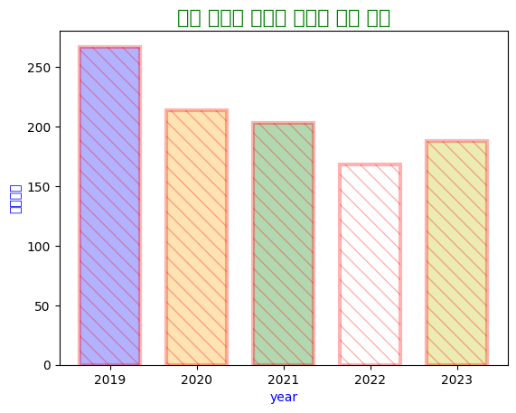
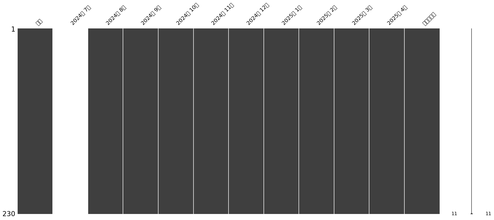

# 04. Pandas

pandas의 `Series`/`DataFrame` 기본 사용법부터 결측치 처리, 중복 제거, `groupby`, `merge`, `pivot_table`까지 데이터 정제·가공을 학습한 실습 코드입니다.

## 학습 내용

- `Series`/`DataFrame` 생성, 행·열 추가/삭제(`loc`, `insert`, `drop`)
- `rename`으로 컬럼/인덱스 이름 바꾸기
- 결측치 확인/처리: `isnull`, `dropna`, `fillna`
- 중복 확인/제거: `duplicated`, `drop_duplicates`
- 조건 필터링: 불리언 인덱싱, `query()`
- `groupby`, `pivot_table`, `merge`, `concat`
- `pd.cut`/`pd.qcut`으로 구간 나누기, `rank()`로 순위 매기기
- `missingno`로 결측치 패턴 시각화

## 실습 파일

| 파일 | 학습 내용 |
|---|---|
| `01_series_and_dataframe_basics.ipynb` | Series/DataFrame 기초, CSV 읽기, `concat`, `groupby`, `merge` |
| `02_series_and_dataframe_practice2.ipynb` | 위 내용을 다른 데이터로 다시 연습 |
| `03_dataframe_actors_groupby_practice.ipynb` | 배우 정보 DataFrame으로 `groupby`, `to_numpy` 연습 |
| `04_data_cleaning_assessment_scores1.ipynb` | 성적 데이터 결측치/중복 제거 수행평가 |
| `05_data_cleaning_assessment_scores1_retry.ipynb` | 위 수행평가를 다시 연습한 버전 |
| `06_groupby_and_plot_practice.ipynb` | 제품별 `groupby` 집계 후 막대/꺾은선 그래프 |
| `07_data_cleaning_assessment_temperature1.ipynb` | 기온 데이터 정제 + 연도별 평균 시각화 수행평가 |
| `08_data_cleaning_practice_housing_price.ipynb` | 분양가 데이터 정제, 문자열→숫자 변환 연습 |
| `09_data_cleaning_assessment_temperature1_retry.ipynb` | `07`과 같은 수행평가를 다시 연습한 버전 |
| `10_missing_data_and_pivot_table.ipynb` | `missingno`로 결측치 시각화 + `pivot_table` |
| `11_business_data_cleaning_assignment_v1.ipynb` | 사업장 데이터 정제 + 연도별 개점 현황 시각화 과제 |
| `12_business_data_cleaning_assignment_v2.ipynb` | `11`과 코드가 거의 동일한 두 번째 실습 시도 |

`11`과 `12`는 코드 내용이 사실상 동일합니다. 같은 과제를 다른 시점에 다시 풀어본 결과로 보여, 삭제하지 않고 두 시도 모두 남겨두었습니다.

## 실행 결과

`data/`에 있는 CSV 파일로 이번 정리 작업 중 전 노트북을 재실행하여 검증했습니다. 시각화가 포함된 노트북의 결과 그래프는 `images/`에 저장했습니다.

### 대표 결과

## Troubleshooting

### 1. `KeyError` (실제 발생한 오류)

**문제**

`01_series_and_dataframe_basics.ipynb`에서 `del price['지우게']`처럼 실제 인덱스명(`지우개`)과 다른 철자로 접근해 `KeyError: '지우게'`가 발생했습니다.

**원인**

인덱스명을 오타로 잘못 입력했습니다 (`지우개` → `지우게`).

**해결**

`Series`/`DataFrame`의 인덱스나 컬럼명에 접근하기 전에 `.index`나 `.columns`로 실제 이름을 먼저 확인하는 습관이 필요합니다.

### 2. `AttributeError: module 'pandas' has no attribute 'drop'` (실제 발생한 오류)

**문제**

`02_series_and_dataframe_practice2.ipynb`에서 `pd.drop(df2['과학'])`처럼 `pandas` 모듈 자체에서 `drop`을 호출했습니다.

**원인**

`drop()`은 `pandas` 모듈의 함수가 아니라 `DataFrame`/`Series` 객체의 메서드입니다. `df2.drop(...)`처럼 객체에서 호출해야 합니다.

**해결**

바로 다음 셀에서 `df2.drop(['과학'], axis=1, inplace=True)`로 올바르게 사용한 것을 확인할 수 있습니다. 이처럼 모듈 함수와 객체 메서드를 혼동하지 않도록 주의가 필요합니다.

### 3. `SettingWithCopyWarning`

`fillna`, `astype`, `drop_duplicates` 등을 `inplace=True`와 함께 사용할 때 pandas가 `SettingWithCopyWarning`을 반복적으로 출력하는 것을 여러 노트북(`04`, `05`, `10` 등)에서 볼 수 있습니다.

**원인**

앞서 `df[df.isnull().sum(axis=1) < 2]`처럼 조건으로 슬라이싱해서 만든 `df`가 원본의 "복사본인지 뷰인지" pandas가 확신할 수 없기 때문에 발생하는 경고입니다.

**해결**

경고를 없애려면 슬라이싱 직후 `df = df[...].copy()`로 명시적으로 복사본을 만들거나, `df.loc[조건, '컬럼'] = 값` 형태로 값을 대입하면 됩니다. 이 저장소에서는 학습 당시 실제로 발생한 경고를 그대로 남겨, pandas의 복사/뷰 동작을 이해하는 참고 자료로 남겼습니다.

### 4. 자기 자신을 잘못 참조 (`NameError`)

`08_data_cleaning_practice_housing_price.ipynb`의 마지막 셀에서 `df.pivot_table(df1, ...)`처럼 정의된 적 없는 `df1`을 인자로 넘겨 `NameError: name 'df1' is not defined`가 발생했습니다. `df`를 다시 입력하려던 중의 오타로 보이며, 함수/메서드에 넘기는 변수명이 실제로 존재하는지 실행 전에 확인해야 함을 보여주는 사례입니다.
